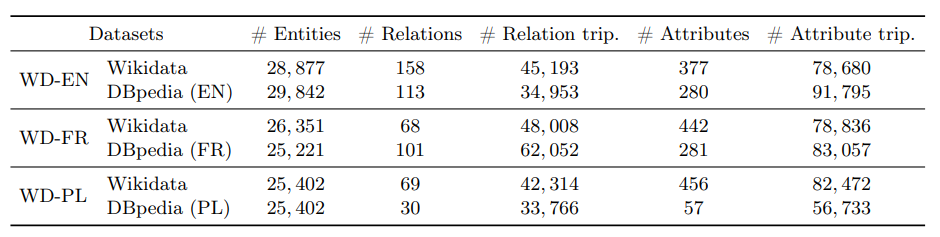
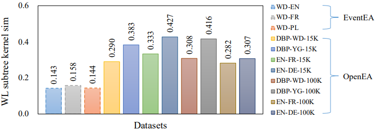
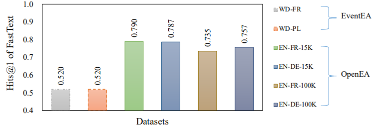
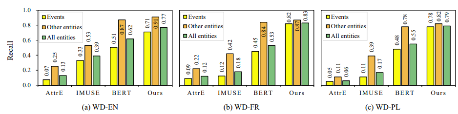

# EventEA: Benchmarking Entity Alignment for Event-centric Knowledge Graphs

> Entity alignment is to find identical entities in different knowledge graphs (KGs) that refer to the same real-world object. Embedding-based entity alignment techniques have been drawing a lot of attention recently because they can help solve the issue of symbolic heterogeneity in different KGs. However, in this paper, we show that the progress made in the past was due to biased and unchallenging evaluation. We highlight two major flaws in existing datasets that favor embedding-based entity alignment techniques, i.e., the isomorphic graph structures in relation triples and the weak heterogeneity in attribute triples. Towards a critical evaluation of embedding-based entity alignment methods, we construct a new dataset with heterogeneous relations and attributes based on event-centric KGs. We conduct extensive experiments to evaluate existing popular methods, and find that they fail to achieve promising performance. As a new approach to this difficult problem, we propose a time-aware literal encoder for entity alignment. The dataset and source code are publicly available to foster future research. Our work calls for more effective and practical embedding-based solutions to entity alignment.

## Table of contents

1. [Dataset](#Dataset)
   1. [Overview](#overview)
   2. [Statistics](#Statistics)
   3. [Evaluation](#Evaluation)
      1. [Structural isomorphism](#Structural_isomorphism)
      2. [Name heterogeneity](#Name_heterogeneity)
   4. [Description](#Description)
   5. [Experiment result](#result)
      1. [Main result](#main)
      2. [Further analysis](#further)
2. [Code](#Code)
   1. [Description](#code_des)
   2. [Dependencies](#Dependencies)
   3. [Usage](#Usage)

## <h2 id='Dataset'>Dataset</h2>

### <h3 id='overview'>Overview</h3>

We choose Wikidata  and DBpedia  as the main sources to build our event-centric dataset. The relational structures and attributes of event entities in them are quite heterogeneous, posing challenges to embedding-based alignment methods. And we also consider the cross-lingual setting.
We use Wikidata (English) as the source KG and DBpedia (English), DBpedia (French) and DBpedia (Polish) are the target KGs .
The data set can be downloaded from https://figshare.com/articles/dataset/EventEA/19720222/1.

| *#* Events |   Languages   | Dataset names |
| :--------: | :-----------: | :-----------: |
|    20K     |    English    |   EN_EN-20K   |
|    20K     | Cross-lingual |   EN_FR_20K   |
|    20K     | Cross-lingual |   EN-PL_20K   |

### <h3 id='Statistics'>Statistics</h3>

The statistics of EventEA are shown below.  



### <h3 id='Evaluation'>Evaluation</h3>

We analyze the dataset in terms of structural isomorphism and attribute value heterogeneity. Compared with existing entity alignment datasets, EventEA has fewer isomorphic structures but more heterogeneous attribute values. Therefore, EventEA is a good choice for evaluating the robustness of embedding-based methods in dealing with difficult entity alignment settings.

#### <h4 id='Structural_isomorphism'>Structural isomorphism</h4>

We mainly adopt the Weisfeiler-Lehman Subtree Kernels on the graphs to compute the structural similarity between the two KGs. The results on EventEA and OpenEA datasets are shown in the following Figure.



#### <h4 id='Name_heterogeneity'>Name heterogeneity</h4>

To evaluate name heterogeneity, we propose a word embedding based method to see its performance on aligning entity names. The  following Figure shows the results on EventEA and OpenEA.



### <h3 id='Description'>Description</h3>

We hereby take the EN_EN_20K dataset as an example to introduce the files in each dataset.  If the setting is cross-lingual, name_list_2 is the names translated into English using Google Translate. we pick ent_links(20%) as training data and leave the remaining (80%) for validation (10%) and testing (70%). The directory structure of each dataset is listed as follows:

```
EN_EN_20K/
├── attr_triples_1: attribute triples in KG1
├── attr_triples_2: attribute triples in KG2
├── rel_triples_1: relation triples in KG1
├── rel_triples_2: relation triples in KG2
├── name_list_1: names of entities in KG1
├── name_list_2: names of entities in KG2
├── ent_links: entity alignment between KG1 and KG2
├── test_links
├── train_links
├── valid_links
```

<h3 id='result'>Experiment results</h3>

<h4 id='main'>Main results</h4>

We conducted extensive experiments to evaluate existing embedding-based entity alignment methods on EventEA. The following Table presents the results of Hits@1, Hits@10 and MRR for different methods on EventEA. In general, our method TAE achieves the best results, and the structure-based methods fail to achieve promising performance.

|                          |          | WD-EN    |          |          | WD-FR    |          |          | WD-PL    |          |
| ------------------------ | -------- | -------- | -------- | -------- | -------- | -------- | :------: | -------- | -------- |
|                          | Hits@1   | Hits@10  | MRR      | Hits@1   | Hits@10  | MRR      |  Hits@1  | Hits@10  | MRR      |
| Levenshtein-Ratio        | .580     | .801     | .661     | .394     | .499     | .431     |   .361   | .534     | .419     |
| Levenshtein-Jaro         | .619     | .817     | .693     | .391     | .483     | .425     |   .341   | .497     | .394     |
| Levenshtein-JW           | .556     | .755     | .630     | .339     | .483     | .388     |   .267   | .378     | .308     |
| SequenceMatcher          | .476     | .705     | .557     | .418     | .537     | .461     |   .474   | .660     | .539     |
| FastText                 | .657     | .866     | .734     | .536     | .719     | .598     |   .541   | .723     | .606     |
| BERT (embed)             | .581     | .820     | .668     | .508     | .665     | .562     |   .524   | .700     | .583     |
| BERT (L4-avg)            | .505     | .721     | .579     | .523     | .694     | .582     |   .467   | .663     | .536     |
| BERT (L4-concat)         | .499     | .713     | .573     | .536     | .719     | .598     |   .464   | .659     | .532     |
| MTransE                  | .053     | .128     | .080     | .106     | .223     | .150     |   .053   | .110     | .061     |
| TransH                   | .045     | .097     | .064     | .080     | .137     | .103     |   .036   | .072     | .050     |
| TransD                   | .042     | .086     | .058     | .080     | .138     | .104     |   .044   | .081     | .059     |
| HolE                     | .004     | .017     | .074     | .015     | .037     | .002     |   .000   | .003     | .002     |
| ProjE                    | .023     | .061     | .037     | .063     | .112     | .083     |   .007   | .017     | .011     |
| IPTransE                 | .047     | .100     | .066     | .084     | .141     | .106     |   .043   | .085     | .060     |
| ConvE                    | .016     | .048     | .027     | .048     | .087     | .064     |   .003   | .011     | .007     |
| AlignE                   | .177     | .410     | .225     | .142     | .293     | .195     |   .092   | .190     | .128     |
| BootEA                   | .219     | .485     | .309     | .168     | .325     | .225     |   .104   | .251     | .155     |
| SimplE                   | .002     | .009     | .005     | .008     | .029     | .016     |   .002   | .010     | .006     |
| RotatE                   | .047     | .137     | .077     | .075     | .196     | .117     |   .035   | .101     | .058     |
| SEA                      | .156     | .389     | .235     | .120     | .273     | .177     |   .087   | .200     | .127     |
| RSN4EA                   | .203     | .350     | .254     | .164     | .239     | .191     |   .107   | .161     | .127     |
| AliNet                   | .146     | .287     | .196     | .150     | .234     | .184     |   .098   | .167     | .126     |
| JAPE                     | .048     | .126     | .074     | .102     | .199     | .139     |   .049   | .092     | .065     |
| GCNAlign                 | .058     | .144     | .088     | .099     | .245     | .154     |   .058   | .139     | .087     |
| AttrE                    | .165     | .337     | .224     | .135     | .267     | .185     |   .074   | .164     | .107     |
| IMUSE                    | .395     | .484     | .426     | .194     | .286     | .231     |   .174   | .249     | .202     |
| MultiKE                  | .230     | .404     | .289     | .144     | .253     | .181     |   .132   | .206     | .158     |
| TAE (ours)               | **.769** | **.917** | **.825** | **.826** | **.905** | **.857** | **.792** | **.896** | **.831** |

<h4 id='further'>Further Analysis</h4>

The following Figure shows the recall of aligning events, other entities, and all entities on our datasets, respectively. We can find that all methods obtain the lowest recall on events across all datasets, which indicates that aligning such special entities with strong heterogeneity is challenging.




## <h2 id='Code'>Code</h2>

### <h3 id='code_des'>Description</h3>

Folder "code" contains codes of our method TAE and Baseline, in which:

- "TAE.py" is the implementation of TAE;
- "baseline.py" is the implementation of baseline;

### <h3 id='Dependencies'>Dependencies</h3>

- Python 3
- fasttext==0.9.2
- numpy
- python-Levenshtein==0.12.2
- torch
- torchtext
- transformers==4.9.2
- Download wiki.en.bin for fasttext from https://fasttext.cc/docs/en/pretrained-vectors.html.
- Download pytorch version bert-base-uncased from https://huggingface.co/bert-base-uncased.

### <h3 id='Usage'>Usage</h3>
For example, to run TAE on EventEA EN-EN version, use the following script (supposed the dataset EventEA and bert-base-uncased had been download in ../data/)

```
python TAE.py ../data/EventEA en ../data/bert-base-uncased save_model_filepath
```

And you can replace en with fr or pl for other language version.

 To run baseline methods, such as fasttext, on EventEA EN-EN version, use the following script (supposed the dataset EventEA, wiki.en.bin and  bert-base-uncased had been download in ../data/)

```
python baseline.py fasttext ../data/EventEA en ../data/bert-base-uncased ../data/wiki.en.bin
```

And you can replace fasttext with other methods names:

bert-e, bert-L4-avg, bert-L4-concat, Leven-R, Leven-J, Leven-JW, SeqMatch.
